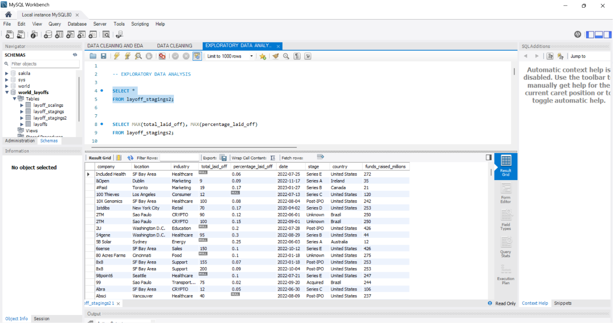
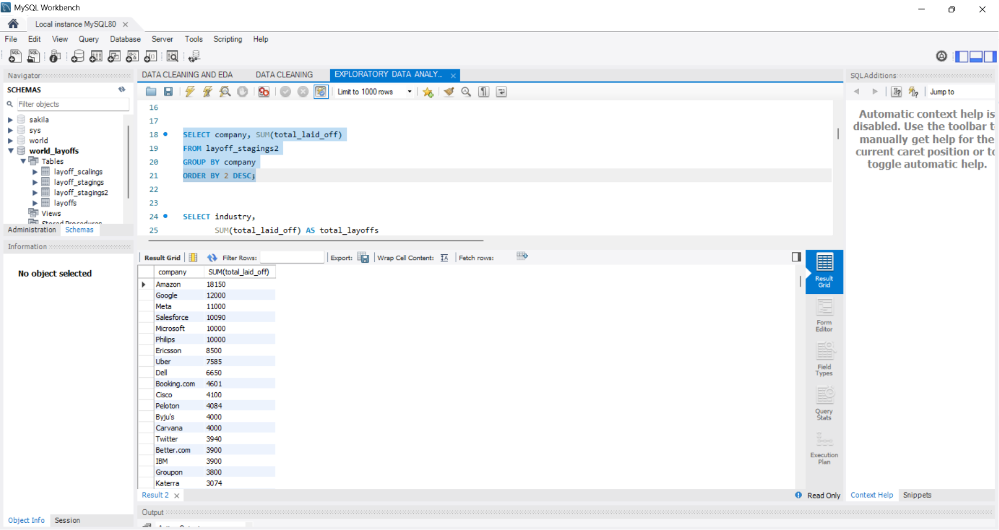
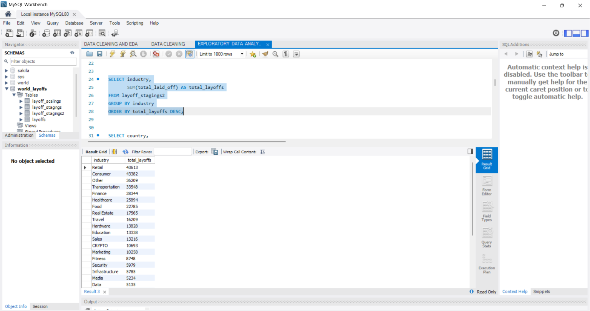
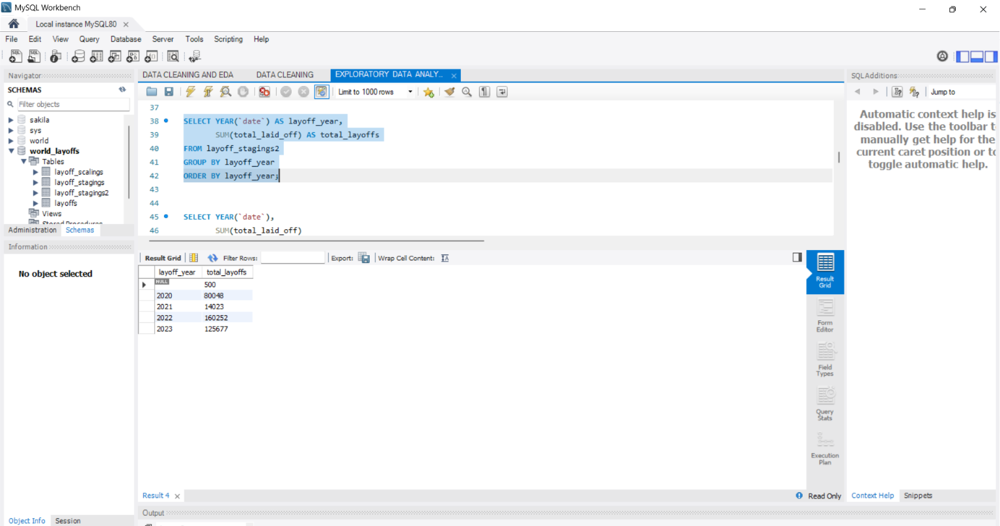
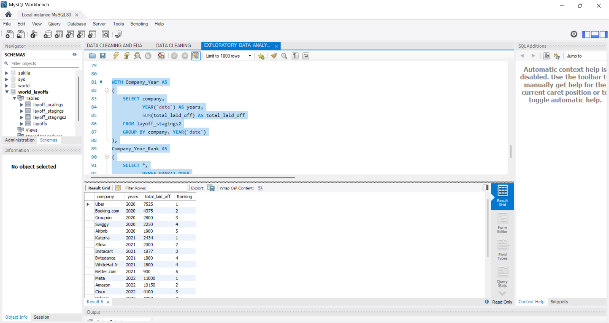

# 📊 SQL Layoffs Data Analysis Project

## 🚀 Project Overview

This project focuses on **Data Cleaning** and **Exploratory Data Analysis (EDA)** using **MySQL** on a real-world layoffs dataset.

The objective was to transform raw data into an analysis-ready format and uncover meaningful business insights regarding layoffs across companies, industries, countries, and years.

This project demonstrates practical SQL skills commonly used by Data Analysts and Business Analysts in real-world scenarios.

---

## 🛠️ Tools & Technologies

* 🐬 MySQL 8.0
* 💻 MySQL Workbench
* 🐙 GitHub

---

## 📂 Project Structure

```text
SQL-Layoffs-Data-Analysis
│
├── Data
│   └── layoffs.csv
│
├── SQL Scripts
│   ├── 01_Data_Cleaning.sql
│   └── 02_Exploratory_Data_Analysis.sql
│
├── Screenshots
│   ├── cleaned_dataset.png
│   ├── layoffs_by_company.png
│   ├── layoffs_by_industry.png
│   ├── layoffs_by_year.png
│   ├── rolling_total.png
│   └── top_companies_per_year.png
│
└── README.md
```

---

## 🧹 Data Cleaning Process

The following data-cleaning steps were performed:

✅ Removed duplicate records

✅ Standardized inconsistent values

✅ Handled NULL and missing values

✅ Corrected formatting issues

✅ Created a clean staging table for analysis

---

## 📈 Exploratory Data Analysis

The following business questions were explored:

### 🏢 Company Analysis

* Which companies laid off the most employees?
* Who were the top companies by layoffs each year?

### 🏭 Industry Analysis

* Which industries were most affected by layoffs?
* Which sectors experienced the highest workforce reductions?

### 🌍 Country Analysis

* Which countries recorded the highest layoffs?

### 📅 Time-Series Analysis

* Layoffs by year
* Monthly layoff trends
* Rolling cumulative layoffs over time

### 🏆 Ranking Analysis

* Top 5 companies by layoffs each year using `DENSE_RANK()`

---

## 🔥 SQL Concepts Demonstrated

### Basic SQL

* SELECT
* WHERE
* GROUP BY
* ORDER BY
* Aggregate Functions

### Intermediate SQL

* Date Functions
* Aliases
* Data Cleaning Techniques

### Advanced SQL

* Common Table Expressions (CTEs)
* Window Functions
* DENSE_RANK()
* Running Totals
* Analytical Queries

---

## 📊 Key Insights

📌 Retail and Consumer industries experienced some of the highest layoffs.

📌 Several large technology companies accounted for a significant portion of workforce reductions.

📌 Layoffs increased dramatically during 2022 and 2023.

📌 Monthly trend analysis revealed distinct layoff waves throughout the period.

📌 Ranking analysis identified the top organizations affected each year.

---

## 📸 Project Screenshots

### Cleaned Dataset



### Layoffs by Company



### Layoffs by Industry



### Layoffs by Year



### Top Companies by Year (DENSE_RANK)



---

## 🎯 Skills Gained

✔ Data Cleaning

✔ Exploratory Data Analysis

✔ Business Insight Generation

✔ SQL Query Optimization

✔ Window Functions

✔ Analytical Thinking

✔ Portfolio Project Development

---

## 👨‍💻 Author

**Ayush Srivastava**

Aspiring Data Analyst | SQL | Python | Power BI | Data Visualization

📌 Feel free to explore the project and share feedback.

